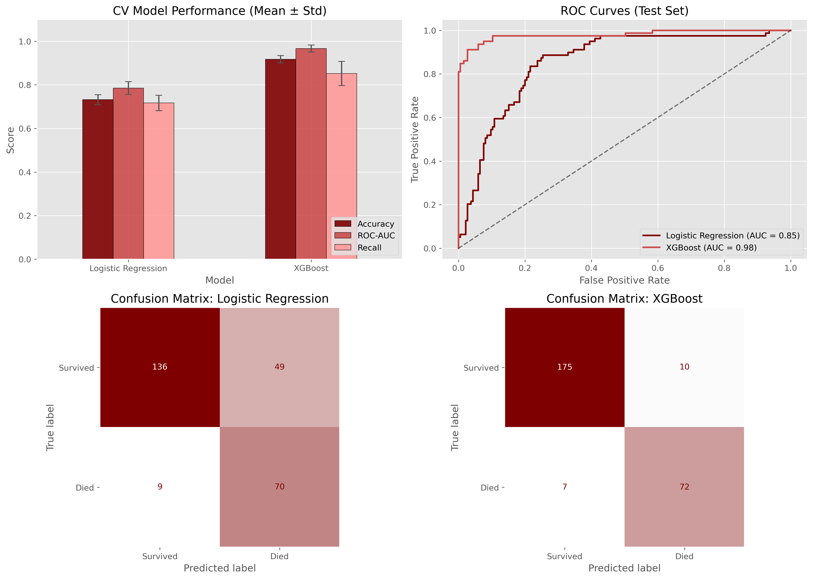

# Heart Failure Risk Prediction


## Project Overview
This project analyzes clinical records of heart failure patients to identify key risk factors for mortality and predict survival outcomes. Beyond building models, the aim is to demonstrate how data-driven tools can help clinicians identify high-risk patients earlier, support prioritization of care, and ultimately improve patient management.

As a biomedical data science portfolio project, it showcases a complete workflow from Exploratory Data Analysis (EDA) and statistical testing to Machine Learning modeling and Survival Analysis, designed with realistic clinical decision support use cases in mind.

The goal is to answer two main questions:
1. **What are the most significant risk factors associated with heart failure mortality?**
2. **Can we use routinely collected clinical features to accurately predict patient survival and stratify patients into meaningful risk groups?**

**Clinical use case scenario:**
*Imagine working with a cardiology ward that needs to identify patients at high risk of death within the next year using only routinely collected clinical data. The aim is not to replace clinicians, but to provide a decision-support tool that helps flag high-risk patients earlier, prioritise follow-up, allocate monitoring resources more efficiently, and ultimately improve patient management.*

Created by Giulio Matteucci in 2025 as a biomedical data science portfolio project.

## Dataset
The dataset used is the **Heart Failure Clinical Records Dataset**.
- **Source**: Kaggle (originally from UCI Machine Learning Repository).
- **Size**: The provided file contains 5000 records; however, EDA reveals significant duplication that is addressed by deduplication.
- **Target Variable**: `DEATH_EVENT` (0 = Survived, 1 = Deceased)
- **Key Features**:
  - `age`: Age of the patient (years)
  - `anaemia`: Decrease of red blood cells or hemoglobin (boolean)
  - `creatinine_phosphokinase`: Level of the CPK enzyme in the blood (mcg/L)
  - `diabetes`: If the patient has diabetes (boolean)
  - `ejection_fraction`: Percentage of blood leaving the heart at each contraction (percentage)
  - `high_blood_pressure`: If the patient has hypertension (boolean)
  - `platelets`: Platelets in the blood (kiloplatelets/mL)
  - `sex`: Woman or man (binary)
  - `serum_creatinine`: Level of serum creatinine in the blood (mg/dL)
  - `serum_sodium`: Level of serum sodium in the blood (mEq/L)
  - `smoking`: If the patient smokes or not (boolean)
  - `time`: Follow-up period (days)

## Methodology

### 1. Exploratory Data Analysis (EDA) & Statistical Testing
- **Data Cleaning**: Identification and removal of duplicate records.
- **Distribution Analysis**: Visualization of clinical variable distributions.
- **Statistical Significance**:
  - **Mann-Whitney U Test** for numeric variables.
  - **Chi-Square Test** for categorical variables.
- **Correlation Analysis** to examine relationships between features.

### 2. Machine Learning Modeling
Two models were trained and evaluated to predict `DEATH_EVENT`:
- **Logistic Regression**: Interpretable baseline model.
- **XGBoost Classifier**: Gradient boosting model capturing non-linear relationships.

**Evaluation Metrics**:
- Accuracy and Recall.
- ROC-AUC (Receiver Operating Characteristic - Area Under Curve).
- Stratified K-Fold Cross-Validation for robust estimation.

These models are designed with a risk stratification perspective in mind: helping flag high-risk patients who may benefit from closer follow-up.

### 3. Feature Importance & Interpretability
- **Logistic Regression Coefficients** clarify direction and magnitude of effects.
- **XGBoost Feature Importance** highlights the most predictive clinical variables.

### 4. Survival Analysis
- **Custom Kaplan-Meier Implementation**: High-performance, vectorized NumPy implementation to estimate survival probability over time.
- **Stratified Analysis**: Survival curves compared across risk groups (e.g., age ranges, ejection fraction levels) with bootstrap confidence intervals (accelerated via multithreading).

## Key Findings
- **Top Risk Factors**: `age`, `ejection_fraction` (low levels), `serum_creatinine`, `serum_sodium` (low levels), are highly associated with mortality risk.
- **Model Performance**: Logistic Regression and XGBoost both achieve strong predictive performance, with XGBoost capturing more complex interactions. In stratified cross-validation, the XGBoost mortality classifier achieves accuracy ≈ 0.92 while the best survival model reach C-index ≈ 0.90.



In practice, this demonstrates that routinely collected hospital data can be transformed into clinically meaningful decision support to identify high-risk patients earlier and support prioritization of care.

## 💻 Project Structure
```
├── data/
│   └── heart_failure_clinical_records.csv  # Dataset
├── misc/                                   # Miscellaneous assets (images, etc.)
├── output/                                 # Generated plots and figures
├── tests/                                  # Unit tests
├── heart_failure_challenge.ipynb           # Main analysis notebook
├── heart_failure_utils.py                  # Main utility module (facade)
├── hf_analysis.py                          # Computation and modeling functions
├── hf_visualization.py                     # Plotting and visualization functions
├── environment.yml                         # Conda environment configuration
└── README.md                               # Project documentation
```

## ⚙️ Installation & Usage

1. **Clone the repository**:
   ```bash
   git clone <repository-url>
   cd <repository-folder>
   ```

2. **Set up the environment**:
   This project uses `conda` for dependency management.
   ```bash
   conda env create -f environment.yml
   conda activate hf_challenge
   ```

3. **Run the Notebook**:
   Launch Jupyter Notebook or VS Code to explore the analysis.
   ```bash
   jupyter notebook heart_failure_challenge.ipynb
   ```

## Dependencies
- Python 3.10+
- pandas, numpy
- matplotlib, seaborn
- scipy
- scikit-learn
- xgboost
- lifelines
